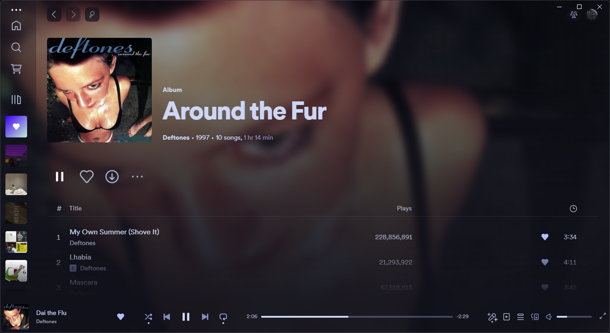

# Spicetify Galaxy

### A fully dynamic and customisable theme that uses fullscreen images to greatly improve your Spotify experience. 

---
### Fullscreen Artist/Album Backgrounds


---

### Manual Installation

After cloning the repo add the files `user.css` and `color.ini` into a new folder named `Galaxy`, and place this folder into your `Themes` folder in `.spicetify`.

Then run these commands to apply:

```powershell
spicetify config current_theme Galaxy
spicetify config inject_css 1 replace_colors 1 overwrite_assets 1
spicetify apply
```

To enable the extension (which is a necessary step), add the file `galaxy.js` into the `Extensions` folder in `.spicetify`.

Then run the commands:

```powershell
spicetify config extensions galaxy.js
spicetify apply
```

---

If you really like the theme i'd be grateful if you liked the repo ❤️.
